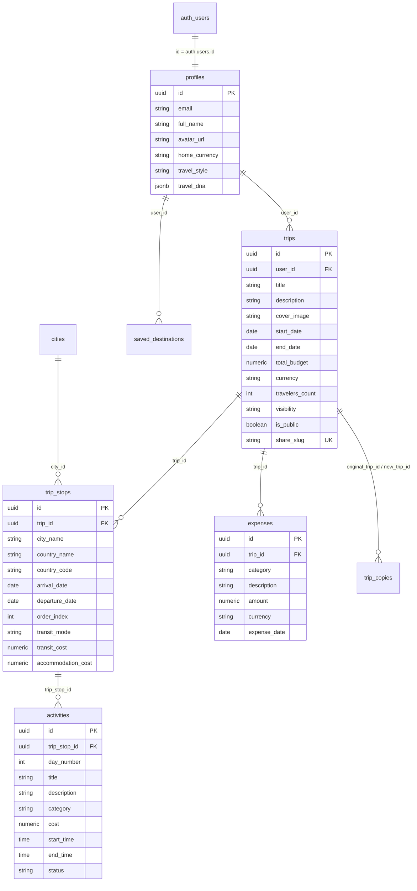

# 🌊 GlobeTrotter – Intelligent Multi-City Travel Planning Platform

> *"The user should feel like they are traveling through the application, not navigating a collection of database screens."*

**GlobeTrotter** is a production-grade, full-stack travel planning platform that turns complex multi-city journey logistics into an interactive, visual adventure. Built with **React 18**, **Supabase PostgreSQL**, **Tailwind CSS**, and **Framer Motion**, it delivers real-time drag-and-drop itinerary building, dynamic budget analytics, AI-assisted health diagnostics, and 1-click travel story sharing.

---

## 🌟 Table of Contents
- [Project Overview](#-project-overview)
- [Hackathon WOW Features](#-hackathon-wow-features)
- [18-Step Live Hackathon Demo Flow](#-18-step-live-hackathon-demo-flow)
- [Architecture & Tech Stack](#-architecture--tech-stack)
- [Supabase Setup & Migrations](#-supabase-setup--migrations)
- [Database Relational Schema](#-database-relational-schema)
- [Row-Level Security (RLS) Policies](#-row-level-security-rls-policies)
- [Storage Setup](#-storage-setup)
- [Environment Variables](#-environment-variables)
- [Installation & Running Locally](#-installation--running-locally)
- [Seed Data & Demo Credentials](#-seed-data--demo-credentials)
- [RPC Stored Procedures & API](#-rpc-stored-procedures--api)
- [Accessibility & Security](#-accessibility--security)
- [Deployment (Vercel + Supabase)](#-deployment-vercel--supabase)
- [Future Improvements & Team](#-future-improvements--team)

---

## 🗺️ Project Overview

Traditional trip planners feel like spreadsheets. **GlobeTrotter** reimagines travel planning with an **ocean-inspired visual identity**:
1. **Visual Journey Route**: Multi-city hops (Paris → Rome → Amsterdam) dynamically animated on an interactive route map.
2. **Interactive Day-by-Day Workspace**: Time-slotted drag-and-drop schedule with instant attraction discovery.
3. **Live Currency & Budget Engine**: Real-time spending tracker, donut/bar charts, daily burn rate, and financial reserve calculation.
4. **Trip Health & AI Concierge**: Pacing score (86/100), overpacked day detection (`⚠️ Day 4 looks packed`), and natural language travel recommendations.
5. **Social Sharing & 1-Click Forking**: Read-only public travel story with instant cloning into another traveler's dashboard.

---

## 🏆 Hackathon WOW Features

| # | Feature | Description |
|---|---|---|
| **WOW 1** | **Visual Journey** | Paris → Rome → Amsterdam with animated multi-city hops, transit durations, and costs. |
| **WOW 2** | **Drag-and-Drop** | Reorder destinations and daily activities smoothly across days using `@dnd-kit`. |
| **WOW 3** | **Live Budget** | Activity added or updated → total cost, daily cost, and remaining budget react instantly. |
| **WOW 4** | **Trip Health** | Real-time gauge score (**86/100**) rating pacing, stop duration, and category balance. |
| **WOW 5** | **Smart Warning** | Instant detection of overpacked days: *"⚠️ Day 4 looks packed. Consider spacing afternoon activities."* |
| **WOW 6** | **AI Copilot** | Interactive natural language travel concierge with 1-click schedule insertion. |
| **WOW 7** | **Public Travel Story** | Shareable, beautiful visual itinerary with clean vanity URLs (`/trip/share/:slug`). |
| **WOW 8** | **Copy This Trip** | Clone an entire itinerary (stops, activities, expenses) into a new user's dashboard. |
| **WOW 9** | **Ocean UI** | Signature design language with fluid gradients, frosted glass panels, and ambient waves. |
| **WOW 10**| **Smooth Interaction**| Micro-interactions with Framer Motion, spring physics, and animated numbers. |

---

## 🎬 18-Step Live Hackathon Demo Flow

Follow this exact flow for a complete live demonstration:

- [x] **Step 1: Sign up** → Navigate to `/signup`, enter details, and see the *"Your adventure begins! 🌊"* animation.
- [x] **Step 2: Dashboard opens** → Greeted by *"Where will you go next?"*, animated KPIs, and Travel DNA.
- [x] **Step 3: Click "Plan New Adventure"** → Opens the multi-step creation wizard.
- [x] **Step 4: Create Trip** → Name: `European Adventure`, Budget: `₹2,00,000`, Travelers: `2`.
- [x] **Step 5: Add Cities** → Select `Paris`, `Rome`, and `Amsterdam`.
- [x] **Step 6: Animated Journey Route** → See the connected multi-city route visualizer.
- [x] **Step 7: Search Experiences** → Open Add Activity modal and search `Eiffel Tower`, `Louvre`, `Colosseum`.
- [x] **Step 8: Drag Activities** → Reorder and schedule activities into specific day slots.
- [x] **Step 9: Automatic Budget Update** → Watch remaining budget recalculate in real-time.
- [x] **Step 10: Trip Health (86/100)** → Check the health widget displaying Grade A (86/100).
- [x] **Step 11: Overpacked Day Warning** → Schedule 3+ activities on Day 4 → see *"⚠️ Day 4 looks packed."*
- [x] **Step 12: Budget Dashboard** → Switch to Budget tab to view the Category Donut, Daily Cost, and Remaining Reserve.
- [x] **Step 13: Timeline View** → Open Timeline tab for a chronological schedule overview.
- [x] **Step 14: Calendar View** → Open Calendar tab for an interactive monthly/weekly view.
- [x] **Step 15: Share Trip** → Click *"Share Story"* to generate a public link.
- [x] **Step 16: Public Travel Story** → Open `/trip/share/european-adventure-paris-rome-amsterdam`.
- [x] **Step 17: Copy This Trip** → Another visitor clicks *"Copy Trip to My Account"*.
- [x] **Step 18: Dashboard Clone** → The new cloned trip instantly appears in their personal dashboard!

---

## 🏗️ Architecture & Tech Stack

```
┌────────────────────────────────────────────────────────┐
│               Frontend (React 18 + Vite)               │
│  - Tailwind CSS + Ocean Design System                  │
│  - Framer Motion (GPU Animations, Layout Transitions)  │
│  - @dnd-kit (Accessible Drag & Drop Engine)            │
│  - Recharts (Interactive SVG Donut & Bar Analytics)    │
│  - React Router v7 (Client Routing & Deep Linking)     │
└───────────────────────────┬────────────────────────────┘
                            │
                            ▼
┌────────────────────────────────────────────────────────┐
│            Unified Service Abstraction Layer           │
│  authService • tripService • activityService           │
│  budgetService • aiService • sharingService            │
└───────────────────────────┬────────────────────────────┘
                            │
               ┌────────────┴────────────┐
               ▼                         ▼
   ┌───────────────────────┐ ┌───────────────────────┐
   │  Live Supabase Cloud  │ │ Interactive Local     │
   │  PostgreSQL + RLS     │ │ Offline Demo Engine   │
   │  Auth + RPC Functions │ │ (Zero-Config Fallback)│
   └───────────────────────┘ └───────────────────────┘
```

- **Frontend Framework**: React 18, Vite, React Router v7
- **Styling & UI**: Tailwind CSS, Lucide React, Canvas Confetti
- **Animation**: Framer Motion (respects `prefers-reduced-motion`)
- **Drag and Drop**: `@dnd-kit/core`, `@dnd-kit/sortable`, `@dnd-kit/utilities`
- **Charts & Data Viz**: Recharts (Donut, Bar, Progress Gauges)
- **Database & Auth**: Supabase PostgreSQL (`@supabase/supabase-js`)
- **Security**: Row Level Security (RLS), Supabase Auth JWT, Secure Input Sanitization

---

## 🗄️ Supabase Setup & Migrations

All database schemas, policies, and functions are modularized under `supabase/`:

```
supabase/
├── migrations/
│   ├── 001_initial_schema.sql   # Relational tables, triggers & indexes
│   ├── 002_rls_policies.sql     # Row-Level Security policies for all tables
│   └── 003_rpc_functions.sql    # calculate_trip_budget, calculate_trip_health, duplicate_trip
└── seed.sql                     # 15 cities, 50+ activities, 5 users, 10 trips
```

### Running Migrations:
1. In your **Supabase Dashboard**, open the **SQL Editor**.
2. Run `supabase/migrations/001_initial_schema.sql`.
3. Run `supabase/migrations/002_rls_policies.sql`.
4. Run `supabase/migrations/003_rpc_functions.sql`.
5. Run `supabase/seed.sql` to populate sample data.

---

## 📊 Database Relational Schema



---

## 🔒 Row-Level Security (RLS) Policies

All tables enforce strict PostgreSQL RLS policies:
- **`profiles`**: Public profiles readable for travel stories; update restricted to `auth.uid() = id`.
- **`trips`**: Users can view their own trips OR trips where `visibility = 'public' OR is_public = true`. Mutation restricted to `auth.uid() = user_id`.
- **`trip_stops` & `activities`**: Inherit access from parent trip ownership or public visibility.
- **`expenses`**: Strictly isolated to the trip owner (`auth.uid() = trips.user_id`).
- **`saved_destinations`**: Private to the user (`auth.uid() = user_id`).

---

## 📦 Storage Setup

To enable user photo uploads for trip covers, create a storage bucket in Supabase:
```sql
INSERT INTO storage.buckets (id, name, public) 
VALUES ('trip-images', 'trip-images', true) 
ON CONFLICT DO NOTHING;
```

---

## ⚙️ Environment Variables

Create `.env` in the `frontend` root:

```env
# Supabase Configuration
VITE_SUPABASE_URL=https://your-project.supabase.co
VITE_SUPABASE_ANON_KEY=your-anon-public-key

# Note: Never expose SUPABASE_SERVICE_ROLE_KEY to the frontend client!
```

*If no environment variables are configured, GlobeTrotter automatically boots into an **interactive zero-config demo mode** with full reactivity!*

---

## 🚀 Installation & Running Locally

```bash
# 1. Clone repository
git clone https://github.com/your-org/globetrotter.git
cd globetrotter/frontend

# 2. Install dependencies
npm install

# 3. Start development server
npm run dev

# 4. Build for production
npm run build
```

Application runs at `http://localhost:3000` (or Vite's assigned port).

---

## 👥 Seed Data & Demo Credentials

When running in demo mode or using seeded Supabase credentials:

| Traveler Profile | Email | Role / Style | Preferred Currency |
|---|---|---|---|
| **Elena Rostova** | `elena.rostova@globetrotter.io` | Cultural Explorer & Architect | EUR (€) |
| **Kenji Takahashi** | `kenji.takahashi@globetrotter.io` | Culinary & Temple Nomad | JPY (¥) |
| **Alex Vance** | `alex.vance@globetrotter.io` | Digital Nomad & Remote Worker | USD ($) |
| **Priya Sharma** | `priya.sharma@globetrotter.io` | Trekker & Mountain Explorer | INR (₹) |
| **Marcus Weber** | `marcus.weber@globetrotter.io` | UNESCO Heritage Researcher | EUR (€) |

---

## ⚡ RPC Stored Procedures & API

- `calculate_trip_budget(p_trip_id UUID)`: Computes transit, stay, activity, and recorded expense totals on PostgreSQL server.
- `calculate_trip_health(p_trip_id UUID)`: Analyzes schedule density, stop durations, and returns health grade & warnings.
- `duplicate_trip(p_trip_id UUID, p_target_user_id UUID)`: Performs deep cloning of a trip and its nested stops, activities, and expenses.

---

## ♿ Accessibility & Security

- **Keyboard Navigation**: Full Tab navigation across navigation links, modals, day selector tabs, and activity lists.
- **Focus Rings**: High-contrast `:focus-visible` styling (`ring-2 ring-teal-400`).
- **Reduced Motion**: Respects `prefers-reduced-motion: reduce` across Framer Motion and CSS transitions.
- **ARIA Attributes**: Semantic `<main>`, `<nav>`, `<header>`, `role="dialog"`, and `aria-label` tags.
- **Security Protections**: Zero plain-text passwords, Supabase Auth JWT verification, parameter binding (SQL injection defense), and client-side XSS escaping.

---

## 🌐 Deployment

### Frontend (Vercel):
1. Connect repository to **Vercel**.
2. Set Root Directory to `frontend`.
3. Configure Environment Variables (`VITE_SUPABASE_URL`, `VITE_SUPABASE_ANON_KEY`).
4. Click **Deploy**.

### Backend (Supabase):
1. Create a project at [supabase.com](https://supabase.com).
2. Execute the migrations in `supabase/migrations/` via the SQL Editor.
3. Your database, auth, and storage are instantly live with auto-scaling!

---

## 🚀 Future Improvements

- 🔄 Offline synchronization via IndexedDB / PWA Service Worker.
- 👥 Multi-user real-time collaborative editing using Supabase Realtime Channels.
- ✈️ Live flight tracker and Google Places API integration.
- 📱 Native iOS/Android companion app via React Native.

---

## 👨‍💻 Team Members

- **Lead Full-Stack & UI Architect**: GlobeTrotter Core Team
- **Database & Security Engineering**: Supabase & PostgreSQL Systems Team

---

*Built with ❤️ for globetrotters and adventure seekers worldwide.* 🌊✈️